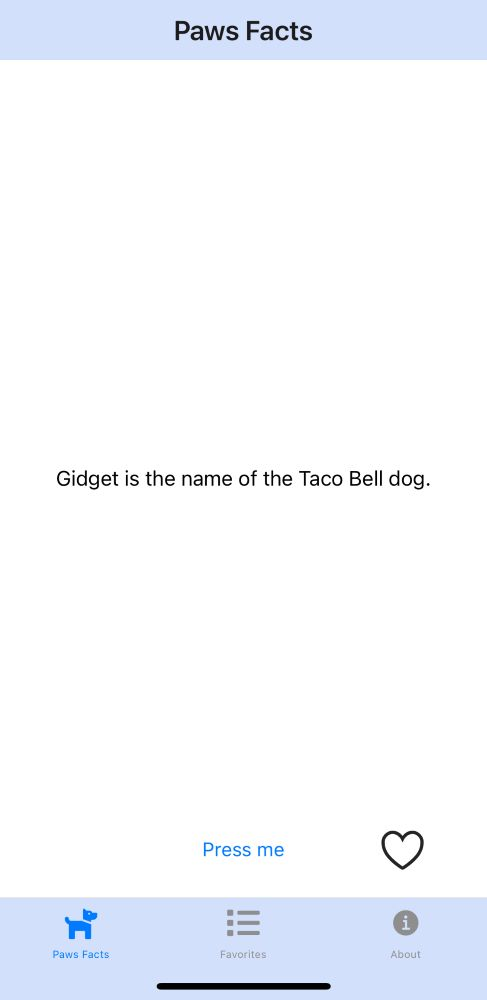
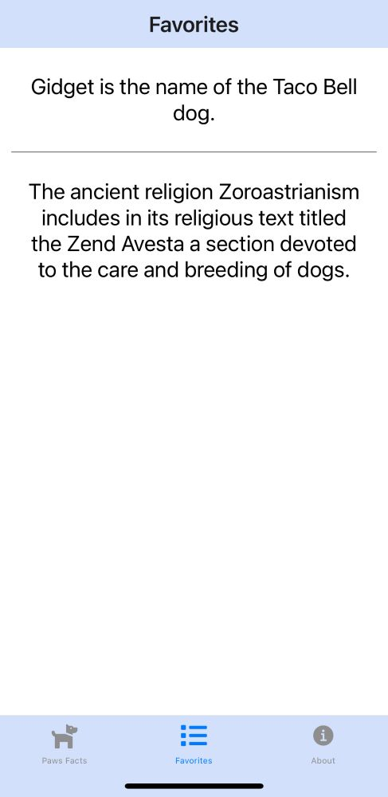

# Paw Facts
Paw Facts displays a random dog fact to your device at a push of a button. You can also save your favorite facts and read them through your favorites tab. 

## Features
- Homescreen Tab:
  - A new dog fact appears whenever the "Press Me" button is pressed
  - Pressing the heart button saves the dog fact to the favorites section
     - Pressing the heart button again will remove the dog fact from the favorites
- Favorites Tab:
  -   Displays the users' favorite dog facts
  -   Users can remove a dog fact by swiping to the left
- About Tab:
  - History and introduction of the application
  
## Screenshots
Homescreen

Favorite Fact Liked

Favorites Screen

Deleting Favorite Fact

## Tech Stack
- [React Native](https://reactnative.dev/)
- [Expo](https://expo.io/)
- [React Navigation](https://reactnavigation.org/)
- [Context API](https://react.dev/reference/react/createContext)
- [Dog Facts API](https://dogapi.dog/docs/api-v2)
  
## About 
Paws Facts is my first React Native mobile app. I own the sweetest and ditziest Golden Retriever and so I wanted to create something about dogs!
