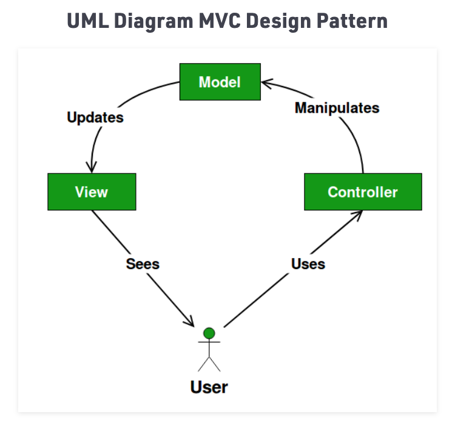
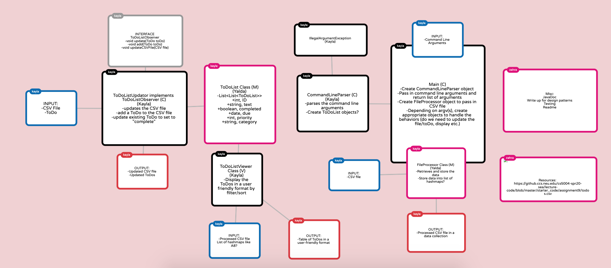
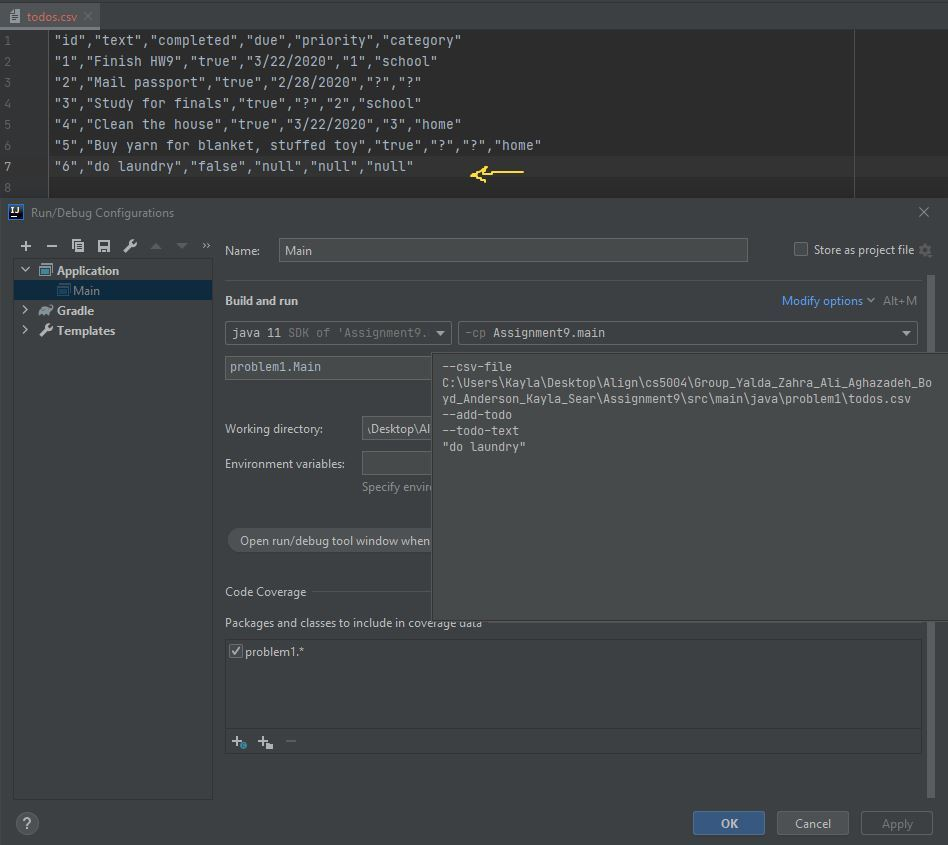
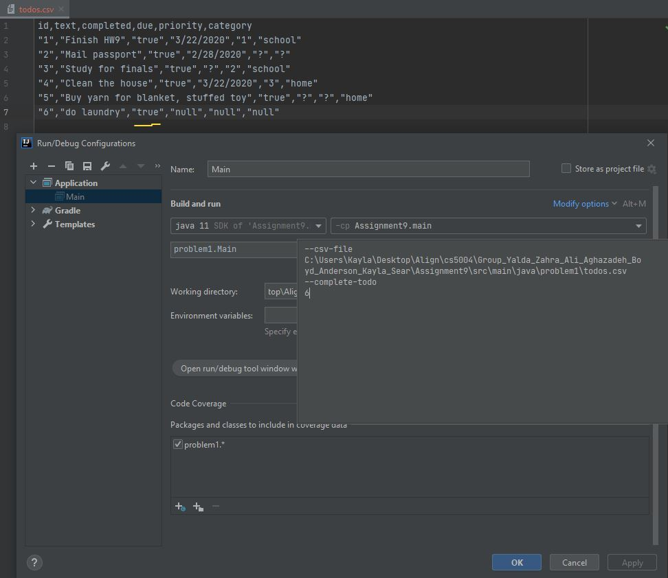
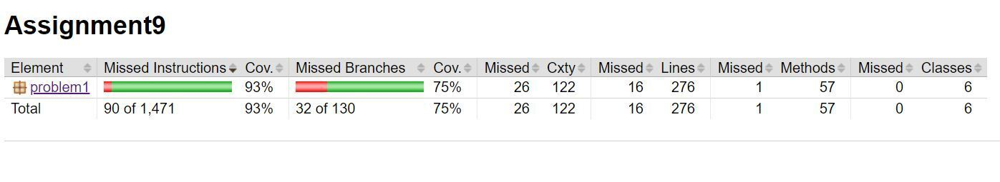
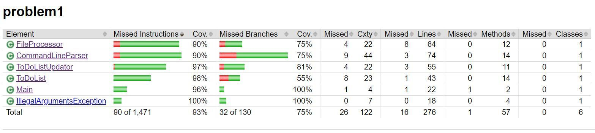

# Assignment 9 Todo Application
## Java I/O , CLI, Java Classes, Unit testing with JUnit4, Regex,  MVC architecture, Design pattern use
## Table of contents

* [General info](#general-info)
* [Write Up](#write-up-of-design-pattern)
* [Screenshots](#screenshots)
* [Installation](#installation)
* [Usage](#usage)
* [Credits](#credits)
* [Features](#features)
* [Status](#status)
* [License](#license)
* [Contributors](#contributors)

## General Info
>  This assignment has one package, it is a command line todo application. The system will allow a user to add and
track the status of their todos by due date, category, priority, and status (complete/incomplete).
> 
> The application stores all todos in a CSV file. The CSV file is a plain text file, containing data
organized into columns separated by a comma. The data in each column is enclosed in double
quotes. The first line of the file contains the headers for each column.
> 
> Currently, we have the controller, and the model implemented, and we will be working on the view in the future

## Write Up of Design Pattern
Model-view control (MVC) is what we used for this project. <br>
(Below Image is from GeeksforGeeks)

<br>
MVC _in_theory_ 
is useful when Pattern of behavior in response to inputs
(controller) are independent of visual geometry (view) <br>
Controller contacts view to interpret what input
events should mean in the context of the view <br>
and _In_practice_
View and controller are so intertwined that they
almost always occur in matched pairs (ex:
command line interface)
<br>
Brief Summary of MVC for this project:
<hr>
1) Model: <br>
(contains only the pure application data, it contains no logic describing how to
present the data to a user.) <br>
* Decide to change the ToDo 's status, ToDoList class, FileProcessor class,
<br>
  <hr>
2) View: <br>
  (presents the model's data to the user. The view knows how to access the model's data, but it 
  does not know what this data means or what the user can do to manipulate it.) <br>
* Viewing the Todos, filtered based on not completed, etc
<br>
  <hr>
3) Controller: <br>
  (exists between the view and the model. It listens to events triggered by the
  view (or another external source) and executes the appropriate reaction to these events.
  In most cases, the reaction is to call a method on the model. Since the view and the model are
  connected through a notification mechanism, the result of this action is then automatically
  reflected in the view.) <br>
* ToDoListObserver, ToDoListUpdator, Main

<hr>
In our design approach, we have decided to implement the assignment into 2/3 parts of the Model,
View, and Controller design architecture. For the Model concept, the FileProcessor
and ToDoList Classes primarily retrieves and stores data from the CSV file.
The FileProcessor Class processes the CSV file and stores each data row
into a collection (we did a list of lists of strings). Then we also decided to
create a method in that class to initialize a list of ToDoList objects as it
iterates through each data row. Another design approach that we could have done,
is to implement another class that builds the existing ToDoLists objects and uses the builder design
pattern, however we thought it was easier to have the FileProcessor implement
that functionality since it is already processing the file. The ToDoList Class
represents a ToDo object and stores the information/fields that were provided
in the CSC file. <br>

<br>
For the Controller part, the CommandLineParser and ToDoListUpdator Classes primarily
serves as receiving the user input and decides on what to do in response.
The CommandLineParser Class also serves as a Model as it is storing the fields of
the ToDoList Class by reading in the command line arguments provided from the user. Our
CommandLineParser holds the arguments and passes it to Main for the system to
decide on what functionality to do based on the arguments. From there, the
ToDoListUpdator executes the actions - whether it be adding a new ToDo to the
CSV file or updating an existing one by setting it to be complete. We also wanted to
try to implement the Obesrver patter by using an interface (ToDoListObserver)
that our ToDoListUpdator uses. Our reason is that the ToDoListUpdator "updates"
the CSV file when notified by the user, similar to the concept of what the Observer
pattern does. Although our design does not necessarily notifies a list of 
observers in this assignment, we thought we could try to use this pattern in a way
that the user is notifying the system and then the system makes the necessary changes. <br>

In the popplet below , each class in this design is marked with M, V or C. 
We have not implemented the view quite yet. <br> <br>
 <br>

## Screenshots
 Below we add a Todo and the csv file gets updated in the csv file <br>
 <br> <br>
Below we set the complete as true and it gets updated in the csv file <br>
 <br> <br>
Below is the test coverage shown: <br> 
 <br>
 <br>
<hr>

## Installation
* [IntelliJ_idea](https://www.jetbrains.com/idea/)
* [Git](https://git-scm.com/download/)
* [JDK version 11](https://www.oracle.com/java/technologies/javase-jdk11-downloads.html)
To install any of the above , use the link for your device's operating system and then follow the right prompts to install.
If you have a .edu email account from your school, you can get a free JetBrains license and get the Ultimate version of IntelliJ.

#### additional links
[Java Documents](https://docs.oracle.com/en/java/javase/11/docs/api/index.html)
[MVC Pattern GfG](https://www.geeksforgeeks.org/mvc-design-pattern/)

## Usage
In order to use any of the codes, first download or clone the repository, then
double-click on the ```build.gradle``` file and that will cause IntelliJ to start building
the project as Java. In the drop-down you would need to choose the ```JDK 11```. The
classes are usually in the src folder and the tests in the test folder.

## Special Instructions for path:
From the ```Run``` tab, choose ```Edit Configurations```.
Then click on the + sign and
From ```Applications``` choose ```Main```
Then type the path similar to the below screen shot.
below:
You can create a folder on your desktop and call it output and another
inside that called output1 to store the templates <br>
 <br>


## Credits
curriculum from [Northeastern University Khoury College of Computer Science](https://www.khoury.northeastern.edu/) - Professor Tamara Bonaci

## Features
List of features:
* Use of CLI, Regex, MVC design pattern and Java I/O as assigned for the requirements of this assignment
* Passed the unit testing in JUnit 4 with over 90% coverage
* UML diagram
* Comments as Java documents within the code
* Gradle reports ( tests, PMD )
To-do list:
* Implement the View part for this project
* Make the code more polished and add more test cases <br>

## Status
Project is:  _finished_

#### Inspiration
Java is one of the top languages used.

## License
MIT license
Copyright © 2021 Zahra Ali Aghazadeh , Boyd Anderson, Kayla Sear

## Contributors
Feel free to contact us via linkedIn for any feedbacks, questions or collaborations!

 <br>
Yalda Ali Aghazadeh <br>
Email: zahraaliaghazadeh@gmail.com <br>
[LinkedIn](https://www.linkedin.com/in/zahraaliaghazadeh/)

 <br>
Kayla Sear <br>
Email: sear.k@northeastern.edu <br>
[LinkedIn](http://linkedin.com/in/kayla-sear-963961139)
